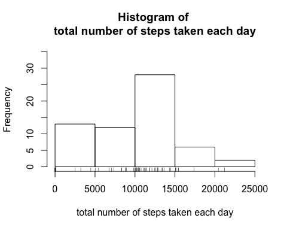
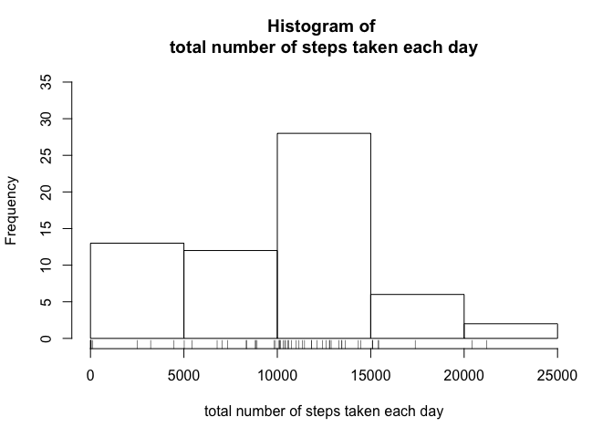
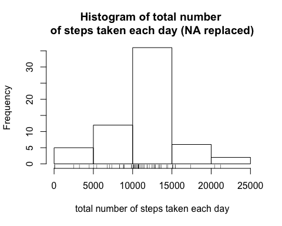
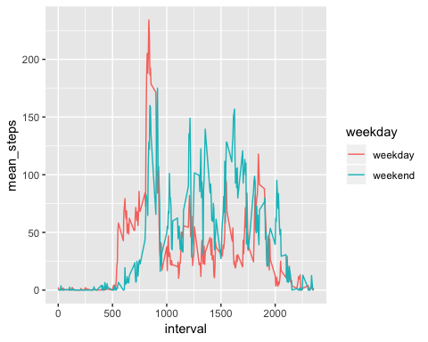

## Loading and preprocessing the data

```r
activity<-read.csv('activity.csv',header=T,stringsAsFactors = F)
activity$date<-as.Date(activity$date,"%Y-%m-%d")
```

## What is mean total number of steps taken per day?
1. Make a histogram of the total number of steps taken each day

```r
library(dplyr, warn.conflicts=FALSE)
activity_dailytotal<- activity %>% 
                      group_by(date) %>%
                      summarise(total = sum(steps,rm.na=TRUE)) %>%
                      ungroup(activity) %>% 
                      na.omit 

hist(activity_dailytotal$total,xlab = 'total number of steps taken each day',main = 'Histogram of \ntotal number of steps taken each day',ylim = c(0,25),breaks=10)
rug(activity_dailytotal$total)
```

<!-- -->

2. Calculate and report the **mean** and **median** total number of steps taken per day

```r
summary(activity_dailytotal$total)
```

```
##    Min. 1st Qu.  Median    Mean 3rd Qu.    Max. 
##      42    8842   10766   10767   13295   21195
```
The mean and median total number of steps taken per day are 1.0767189\times 10^{4} and 1.0766\times 10^{4}.

## What is the average daily activity pattern?
1. Make a time series plot (i.e. `type = "l"`) of the 5-minute interval (x-axis) and the average number of steps taken, averaged across all days (y-axis)


```r
activity_timeseries <- activity %>% 
                      na.omit %>%
                      group_by(interval) %>%
                      summarise(mean_steps = mean(steps,rm.na=TRUE)) 

with(activity_timeseries, plot(interval,mean_steps,type='l',ylab = 'average number of steps taken in 5min intervals',main='time series of average number of steps'))
```

<!-- -->

2. Which 5-minute interval, on average across all the days in the dataset, contains the maximum number of steps?

```r
activity_timeseries$interval[which.max(activity_timeseries$mean_steps)]
```

```
## [1] 835
```

## Imputing missing values
1. Calculate and report the total number of missing values in the dataset (i.e. the total number of rows with `NA`s)

```r
sum(is.na(activity$steps))
```

```
## [1] 2304
```

2. Devise a strategy for filling in all of the missing values in the dataset. The strategy does not need to be sophisticated. For example, you could use the mean/median for that day, or the mean for that 5-minute interval, etc.
3. Create a new dataset that is equal to the original dataset but with the missing data filled in.


```r
activity_nareplace <- activity %>% 
                      group_by(interval) %>%
                      mutate_at('steps',function(x) replace(x, is.na(x), mean(x,na.rm=TRUE)))
```

4. Make a histogram of the total number of steps taken each day and Calculate and report the **mean** and **median** total number of steps taken per day. Do these values differ from the estimates from the first part of the assignment? What is the impact of imputing missing data on the estimates of the total daily number of steps?


```r
activity_dailytotal2<- activity_nareplace %>% 
                      group_by(date) %>%
                      summarise(total = sum(steps)) %>%
                      ungroup(activity_nareplace) 
        
hist(activity_dailytotal2$total,xlab = 'total number of steps taken each day',main = 'Histogram of \ntotal number of steps taken each day (NA replaced)',ylim=c(0,25),breaks=10)
rug(activity_dailytotal2$total)
```

<!-- -->


```r
summary(activity_dailytotal2$total)
```

```
##    Min. 1st Qu.  Median    Mean 3rd Qu.    Max. 
##      41    9819   10766   10766   12811   21194
```

The mean and median total number of steps taken per day here with this na replace strategy are 1.0766189\times 10^{4} and 1.0766189\times 10^{4}.
The mean and median of the total number of steps taken per day differ little from the original dataset.
However, as we compare the two histograms, we notice that frequency of the middle column where the total number of steps between 10000 and 15000 increased. This is because missing values are normally missing at all intervals on a certain day. Here, data are missing from 8 days. Using the replacement strategy here, we basically filled up the eight days with an average day pattern of step number.

## Are there differences in activity patterns between weekdays and weekends?

```r
weekday<-weekdays(activity$date)
activity$weekday[(weekday!='Saturday') & (weekday!='Sunday')]<-'weekday'
activity$weekday[(weekday =='Saturday') | (weekday =='Sunday')]<-'weekend'

activity_timeseries_wd <- activity %>% 
                      na.omit %>%
                      group_by(interval,weekday) %>%
                      summarise(mean_steps = mean(steps,rm.na=TRUE)) 
library(ggplot2)
p<-ggplot(data=activity_timeseries_wd,aes(x=interval,y=mean_steps,color=weekday))
p+geom_line()
```

<!-- -->

The plot indicates that average step number from ~500-~1000 interval is higher in weekdays, whereas the step number from ~1000-~2000 is higher during weekends.

